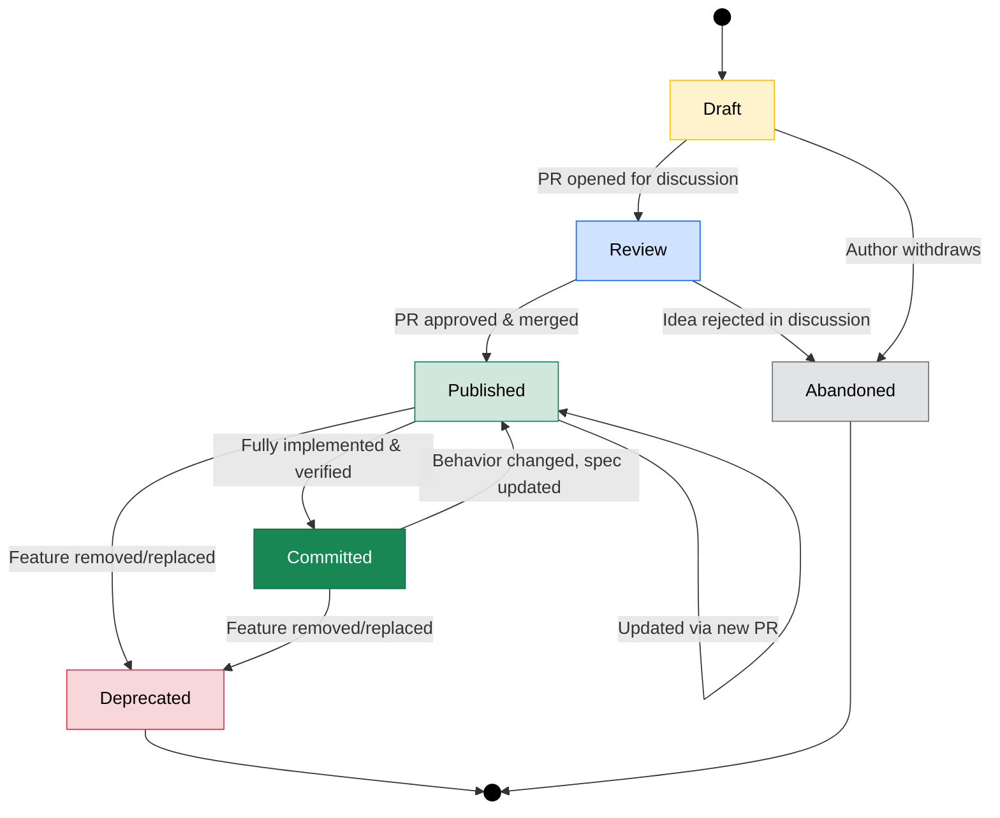
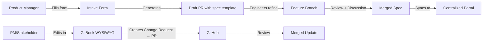
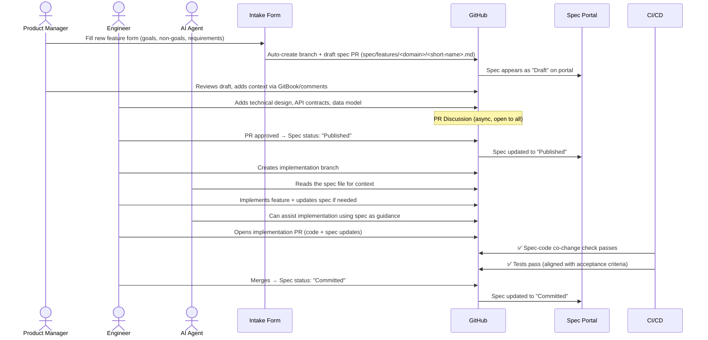
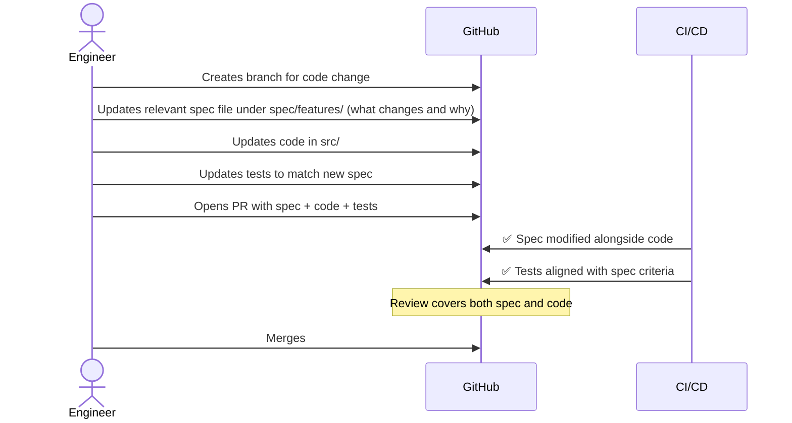
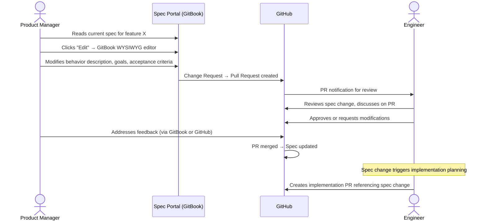
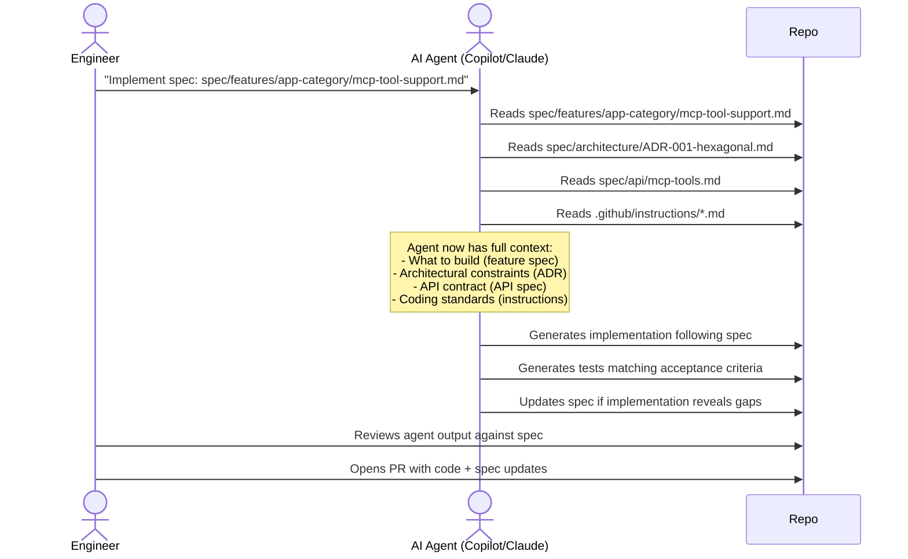
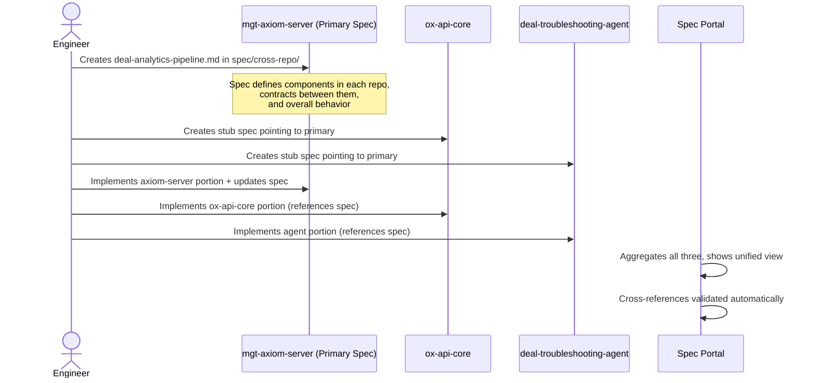
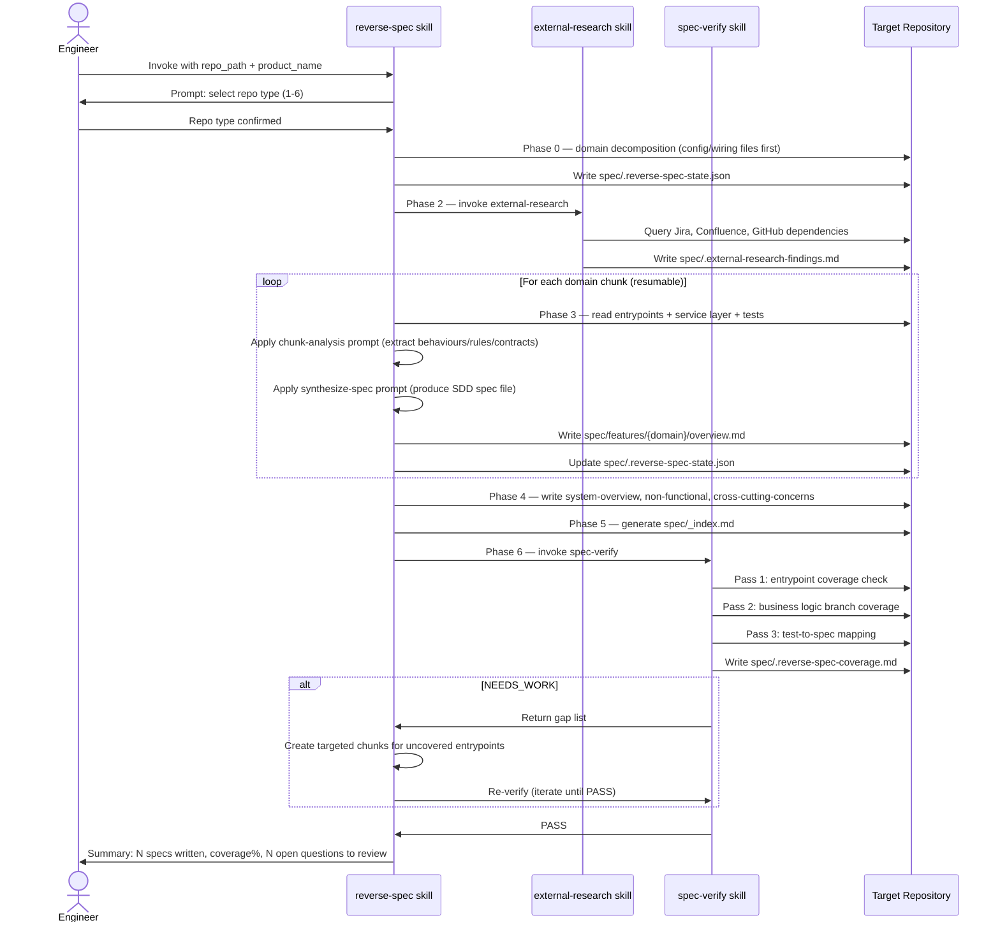

# Specification-Driven Development (SDD) Workflow Proposal

**Date:** 2026-02-15  
**Status:** Draft / Proposal  
**Audience:** Engineering, Product, Leadership

---

## Table of Contents

- [Executive Summary](#executive-summary)
- [Problem Statement](#problem-statement)
- [Research & Prior Art](#research--prior-art)
- [Proposed Workflow: Specification-Driven Development](#proposed-workflow-specification-driven-development)
  - [Core Principles](#core-principles)
  - [Where Specs Live](#where-specs-live)
  - [Spec Format & Structure](#spec-format--structure)
  - [Lifecycle of a Spec](#lifecycle-of-a-spec)
  - [Roles & Responsibilities](#roles--responsibilities)
- [Implementation Architecture](#implementation-architecture)
  - [Layer 1: Specs Alongside Code (Source of Truth)](#layer-1-specs-alongside-code-source-of-truth)
  - [Layer 2: Centralized Portal (Aggregated View)](#layer-2-centralized-portal-aggregated-view)
  - [Layer 3: Non-Technical Access & Editing](#layer-3-non-technical-access--editing)
  - [Layer 4: Automation & Freshness Enforcement](#layer-4-automation--freshness-enforcement)
  - [Layer 5: Spec-Code Co-Change Enforcement](#layer-5-spec-code-co-change-enforcement)
- [Detailed Workflows](#detailed-workflows)
  - [Workflow A: New Feature (Greenfield)](#workflow-a-new-feature-greenfield)
  - [Workflow B: Changing Existing Behavior](#workflow-b-changing-existing-behavior)
  - [Workflow C: Non-Technical Person Proposes a Change](#workflow-c-non-technical-person-proposes-a-change)
  - [Workflow D: Agent-Assisted Development](#workflow-d-agent-assisted-development)
  - [Workflow E: Cross-Repository Feature](#workflow-e-cross-repository-feature)
- [Knowledge Consolidation Strategy](#knowledge-consolidation-strategy)
- [Tooling Recommendations](#tooling-recommendations)
- [Repository Structure Convention](#repository-structure-convention)
- [Spec Template](#spec-template)
- [Implementation Roadmap](#implementation-roadmap)
- [Risks & Mitigations](#risks--mitigations)
- [Success Metrics](#success-metrics)
- [References](#references)

---

## Executive Summary

We propose adopting a **Specification-Driven Development (SDD)** workflow where human-readable specifications are the **primary artifact** from which both code and documentation derive. Specifications live in Git alongside code, are versioned, reviewed via PRs, and are automatically aggregated into a centralized, searchable portal accessible to everyone — including non-technical stakeholders.

For the short, enforceable rules (what lives in Jira vs what lives in specs, who approves what), see: [`doc/guideline/sdd-policy.md`](guideline/sdd-policy.md)

This approach solves the chronic problem of knowledge fragmentation across Confluence, Jira, Google Docs, Slack, and tribal verbal knowledge by establishing a **single source of truth** that is:

1. **Co-located with code** — so developers and AI agents find it immediately
2. **Versioned and auditable** — so freshness is inherent, not aspirational
3. **Human-readable** — so non-technical people can consume and propose changes
4. **Enforceable** — so spec and code change together, by policy

---

## Problem Statement

### Current State

Knowledge in our adtech engineering org is scattered across:

| Source | Freshness | Accessibility | Machine-Readable | Authoritative |
|--------|-----------|---------------|-------------------|---------------|
| Confluence | Varies (often stale) | Good for humans | Poor | Sometimes |
| Jira tickets | Current at creation only | Good for humans | Structured but noisy | For that moment |
| Google Docs | Varies | Good for humans | Poor | Sometimes |
| Slack threads | Ephemeral | Searchable short-term | No | Never |
| Code comments | Tied to code | Developer-only | By agents, yes | For implementation |
| Verbal/tribal | N/A | Inaccessible | No | Often the real truth |

### Pain Points

1. **New team members** spend weeks discovering how things actually work
2. **AI coding agents** have no reliable spec to reference — they can only read code, which shows *what* but not *why* or *what should be*
3. **Non-technical stakeholders** can't easily see current system behavior or propose changes
4. **Cross-repo features** have no unified specification — logic is scattered across `mgt-axiom-server`, `ox-api-core`, `deal-troubleshooting-agent`, etc.
5. **Nobody trusts existing docs** because there's no mechanism ensuring freshness
6. **Jira stories** describe *desired future state at time of writing* but are never updated to reflect what was actually built or how requirements evolved

---

## Research & Prior Art

Our proposal synthesizes practices from multiple proven approaches:

### 1. Documentation-Driven Development (DDD)
**Source:** [zsup/ddd.md](https://gist.github.com/zsup/9434452)

Core idea: *"If a feature is not documented, it doesn't exist. If documented incorrectly, it's broken."*

**What we adopt:** Spec-first mindset. Write the spec before (or simultaneously with) the code. Tests should align with specs.

**What we adapt:** DDD was conceived pre-AI and pre-multi-repo. We extend it with machine-readable structure and cross-repo aggregation.

### 2. Docs-as-Code
**Source:** [Write the Docs](https://www.writethedocs.org/guide/docs-as-code/), [GitBook](https://www.gitbook.com/blog/what-is-docs-as-code)

Core idea: Documentation uses the same tools as code — version control, plain text markup, code reviews, automated tests, CI/CD.

**What we adopt:** Markdown in Git, PRs for review, automated checks, static site generation.

**Key insight from Google (via Riona MacNamara):** Adopting docs-as-code completely transformed how Google does documentation by making writers and developers co-own docs.

### 3. Design Docs at Google
**Source:** [Malte Ubl / Industrial Empathy](https://www.industrialempathy.com/posts/design-docs-at-google/)

Core idea: Informal design documents capturing high-level strategy and **trade-offs** before coding begins. Documents have a lifecycle: creation → review → implementation → maintenance.

**What we adopt:** Structured spec sections (Context, Goals/Non-Goals, Design, Alternatives, Cross-Cutting Concerns). The principle that specs should be updated as implementation reveals gaps.

**Key insight:** *"Most software projects do have a set of actually known problems. Subscribing to agile methodologies is not an excuse for not taking the time to get solutions to actually known problems right."*

### 4. Oxide Computer's Requests for Discussion (RFDs)
**Source:** [Oxide RFD 1](https://oxide.computer/blog/rfd-1-requests-for-discussion)

Core idea: All ideas — technical and organizational — are captured as numbered RFDs in a single Git repo. Lifecycle states: `prediscussion` → `ideation` → `discussion` → `published` → `committed` → `abandoned`. Discussion happens on PRs.

**What we adopt:** The lifecycle states, PR-based discussion, and the principle that *"writing down ideas is important: it allows them to be rigorously formulated, candidly discussed and transparently shared."*

**What we do not adopt:** Sequential IDs for feature specs. In our model the **spec file path is the identifier** (to avoid collisions across branches and repos).

**What we adapt:** Oxide puts all RFDs in one repo. We need specs distributed across multiple repos but aggregated centrally.

### 5. Spotify's TechDocs (Backstage)
**Source:** [Backstage TechDocs](https://backstage.io/docs/features/techdocs/)

Core idea: Engineers write Markdown docs alongside code. A platform (Backstage) automatically discovers, builds, and serves them as a unified documentation portal. 5000+ doc sites at Spotify, ~10000 daily hits.

**What we adopt:** The aggregation model — specs live in each repo, but a central portal crawls and renders them. Discoverability across the entire org from one place.

### 6. Diátaxis Framework
**Source:** [diataxis.fr](https://diataxis.fr/)

Core idea: Documentation has four distinct modes — **Tutorials** (learning-oriented), **How-To Guides** (task-oriented), **Reference** (information-oriented), **Explanation** (understanding-oriented). Each serves a different user need.

**What we adopt:** Our spec structure should separate *what the system does* (reference) from *why it does it* (explanation) from *how to use it* (how-to) from *how to get started* (tutorial).

### 7. Architecture Decision Records (ADRs)
**Source:** [adr.github.io](https://adr.github.io/)

Core idea: Capture individual architectural decisions with context, decision, and consequences. Lightweight, versioned, cumulative.

**What we adopt:** ADRs as a subset of our spec system. Every significant decision gets recorded as part of the spec, not in a separate Confluence page.

### 8. BDD/ATDD (Behavior-Driven / Acceptance Test-Driven Development)
**Source:** Industry practice (Dan North, JBrains, etc.)

Core idea: Acceptance tests written in business language serve as **living documentation** — they verify that requirements are still valid. If behavior changes, tests fail.

**What we adopt:** Link specs to test suites. Spec acceptance criteria should be verifiable. Tests serve as the automated "is this spec still accurate?" check.

---

## Proposed Workflow: Specification-Driven Development

### Core Principles

1. **Spec is the source of truth.** Not Jira, not Confluence, not Slack. The spec in Git is authoritative.
2. **Spec lives with code.** Each repo has a `spec/` directory. Specs are Markdown files, versioned alongside code.
3. **Spec and code change together.** A PR that changes behavior must update the relevant spec. CI enforces this.
4. **Spec is human-readable.** Non-technical people can read specs on the aggregation portal without touching Git.
5. **Spec is machine-readable.** Structured frontmatter allows AI agents, search indexers, and dashboards to parse specs.
6. **Spec is proposable by anyone.** Non-technical stakeholders can propose spec changes via a web UI (GitBook, GitHub web editor, or a custom form → PR pipeline).
7. **Freshness is automated.** Staleness detection, cross-reference validation, and dead-spec cleanup are CI jobs, not human discipline.

### Where Specs Live

```
any-repo/
├── spec/                           # All specifications for this repo
│   ├── _index.md                   # Repo-level overview & spec catalog
│   ├── features/                   # Feature specs (the "what" and "why")
│   │   ├── ad-serving/
│   │   │   └── overview.md
│   │   ├── targeting/
│   │   │   └── overview.md
│   │   └── app-category/
│   │       └── mcp-tool-support.md
│   ├── api/                        # API contracts & schemas
│   │   ├── graphql-schema.md
│   │   └── mcp-tools.md
│   ├── architecture/               # Architecture & design decisions
│   │   ├── ADR-001-hexagonal.md
│   │   ├── ADR-002-cqs-pattern.md
│   │   └── system-overview.md
│   └── cross-repo/                 # Specs that span multiple repos
│       └── deal-analytics-pipeline.md
├── src/                            # Source code
├── doc/                            # Guides, tutorials, how-tos (Diátaxis)
│   ├── guides/
│   ├── tutorials/
│   └── reference/
└── .github/
    └── workflows/
        └── spec-check.yml          # CI: enforce spec-code co-change
```

**Key distinction:**
- `spec/` = **What the system does and why** (normative, authoritative, must match code)
- `doc/` = **How to use/operate the system** (informative, helpful, can lag slightly)

### Spec Format & Structure

Every spec file uses **Markdown with YAML frontmatter** for machine-readability:

**Identifier rule:** There is no sequential feature ID. The canonical identifier for a spec is its **repository + file path**.

```markdown
---
title: "MCP Tool Support for AppCategory"
status: published          # draft | review | published | committed | deprecated
authors:
  - name: "John Smith"
    email: "john@company.com"
created: 2026-01-15
last-updated: 2026-02-10
domain: app-category
repos:
  - mgt-axiom-server
  - deal-troubleshooting-agent
jira-epic: AX-1234         # Link back to Jira for tracking
tags: [mcp, app-category, crud]
freshness-check: 90d       # Alert if not updated in 90 days
---

# MCP Tool Support for AppCategory

## Context & Scope

Brief objective background: what exists today, what problem we're solving.

## Goals

- Expose AppCategory CRUD operations via MCP protocol
- Enable AI agents to create, search, and modify app categories

## Non-Goals

- Replacing the existing GraphQL API
- Supporting bulk operations in v1

## Specification

### Behavior

Describe the expected behavior in business language. This section should be
understandable by a product manager.

### API Contract

```json
{
  "tool": "createAppCategory",
  "parameters": { ... }
}
```

### Acceptance Criteria

- [ ] Agent can create an app category with name and account
- [ ] Agent can search app categories by name
- [ ] Agent receives meaningful errors for invalid input

### Data Model

Relevant entity relationships (can reference architecture docs).

## Design Decisions

### Why MCP over REST?

(ADR-style reasoning with context, decision, consequences)

## Cross-Cutting Concerns

- **Security**: MCP tools respect account-level permissions
- **Observability**: All MCP calls are logged with correlation IDs

## Related

- Architecture: [ADR-001-hexagonal](../architecture/ADR-001-hexagonal.md)
- API Spec: [mcp-tools](../api/mcp-tools.md)
- Cross-repo: [deal-analytics-pipeline](../cross-repo/deal-analytics-pipeline.md)
- Jira: [AX-1234](https://jira.company.com/browse/AX-1234)

### Lifecycle of a Spec




| State | Meaning | Who can transition |
|-------|---------|-------------------|
| **Draft** | Idea being shaped, not ready for broad review | Anyone |
| **Review** | PR open, active discussion happening | Author opens PR |
| **Published** | Approved spec, may not be implemented yet | Reviewers approve PR |
| **Committed** | Spec fully implemented and verified in code | Dev team after implementation |
| **Deprecated** | Spec no longer relevant, kept for history | Anyone via PR |
| **Abandoned** | Idea was rejected or withdrawn | Author or reviewers |

### Roles & Responsibilities

| Role | Reads Specs | Writes Specs | Reviews Specs | Proposes Changes |
|------|-------------|--------------|---------------|------------------|
| **Product Manager** | ✅ Portal | ✅ Via web UI / PR | ✅ On PRs | ✅ Via portal form |
| **Engineering Lead** | ✅ Git + Portal | ✅ Git | ✅ Required reviewer | ✅ Git |
| **Developer** | ✅ Git + IDE | ✅ Git | ✅ On PRs | ✅ Git |
| **AI Agent** | ✅ Git (spec/ dir) | ✅ Can draft | ❌ (suggests, human decides) | ✅ Via PR |
| **QA** | ✅ Portal | ✅ Acceptance criteria | ✅ On PRs | ✅ Via portal form |
| **Stakeholder** | ✅ Portal | ❌ | ❌ | ✅ Via portal form |

---

## Implementation Architecture

### Layer 1: Specs Alongside Code (Source of Truth)

Each repository contains a `spec/` directory with Markdown specs.

**Why in-repo (not a central spec repo):**
- Specs change atomically with code in the same PR
- AI agents reading a repo instantly have the spec context
- Follows the principle of high cohesion
- No cross-repo merge coordination for routine changes

**Cross-repo specs:** For features spanning multiple repos (e.g., deal analytics pipeline touching `ox-api-core`, `deal-troubleshooting-agent`, and `mgt-axiom-server`), we use a **cross-repo spec** in `spec/cross-repo/` that lives in the **primary repo** and references the others. Each referenced repo has a symbolic link or stub pointing back.

```
# In mgt-axiom-server/spec/cross-repo/deal-analytics-pipeline.md (primary)
repos:
  - mgt-axiom-server    # primary
  - ox-api-core          # referenced
  - deal-troubleshooting-agent  # referenced

# In ox-api-core/spec/cross-repo/deal-analytics-pipeline.md (stub)
# This spec is primarily maintained in mgt-axiom-server.
# See: https://github.com/company/mgt-axiom-server/blob/main/spec/cross-repo/deal-analytics-pipeline.md
```

### Layer 2: Centralized Portal (Aggregated View)

A documentation portal automatically discovers and renders specs from all repos.

**Recommended approach — choose one:**

| Option | Pros | Cons | Best For |
|--------|------|------|----------|
| **Backstage + TechDocs** | Open source, mature, plugin ecosystem, service catalog | Heavy setup, Backstage is a full platform | Orgs ready to invest in developer portal |
| **GitBook with Git Sync** | WYSIWYG editing, beautiful rendering, Git bi-directional sync | SaaS cost, less customizable | Quick wins, non-technical editing priority |
| **MkDocs + GitHub Pages** | Free, simple, extensive plugin ecosystem | Manual aggregation script needed, no built-in editing | Lightweight, engineering-centric orgs |
| **Docusaurus** | React-based, versioning, search, i18n | Single-repo oriented (needs multi-instance) | If already in React ecosystem |
| **Custom aggregator** | Full control | Maintenance burden | Last resort |

**Recommended for our case: GitBook with Git Sync** for the initial phase, because:
1. Bi-directional sync means non-technical users can edit in GitBook, and changes sync to Git (and vice versa)
2. Beautiful rendering out of the box
3. Search across all synced repos
4. Supports YAML frontmatter
5. Reasonable cost
6. Fast to set up (days, not weeks)

**Long-term consideration:** Migrate to Backstage if we decide to build a full internal developer portal with service catalog, TechDocs, and software templates.

### Layer 3: Non-Technical Access & Editing

This is a critical requirement: PMs, stakeholders, and QA need to both **read** and **propose changes** to specs without learning Git.

For a step-by-step guide focused on non-technical contributors using GitBook, see: [`doc/guideline/gitbook-spec-workflow.md`](guideline/gitbook-spec-workflow.md)

**For reading:** The centralized portal (GitBook / Backstage / MkDocs site) provides a searchable, browsable interface.

**For proposing changes — three complementary mechanisms:**

#### Mechanism A: GitBook WYSIWYG Editing (Recommended Primary)
- GitBook's editor provides Google Docs-like editing experience
- Changes create "Change Requests" in GitBook, which sync as PRs to GitHub
- Reviewers (engineers) approve/reject on GitHub
- Non-technical users never touch Git

#### Mechanism B: GitHub Web Editor (Lightweight)
- GitHub's built-in file editor (`github.dev` or the pencil icon)
- User edits Markdown directly in browser, creates a PR
- Works for small edits; intimidating for large changes
- Useful for engineers who prefer GitHub UI

#### Mechanism C: Structured Intake Form → Auto-Generated PR (For New Specs)
- A simple web form (Google Form, Jira intake, or custom app) collects:
  - Title, domain, goals, non-goals, basic description
  - Similar to creating a Jira initiative
- Automation (GitHub Action / webhook) generates a spec Markdown file from the template and opens a Draft PR
- Engineers then flesh out the technical details in that branch



**Mapping to Jira experience:** Non-technical users today create initiatives in Jira. With SDD:
- "Creating a Jira initiative" → "Filling the spec intake form" (generates draft spec PR)
- "Updating a Jira ticket" → "Editing in GitBook" (generates spec change PR)
- "Commenting on a Jira ticket" → "Commenting on the PR" (same discussion, but in the open)
- Jira still exists for task tracking; specs are the authoritative **what/why**, Jira tracks **who/when/status**

### Layer 4: Automation & Freshness Enforcement

#### Staleness Detection
```yaml
# .github/workflows/spec-freshness.yml
name: Spec Freshness Check

on:
  schedule:
    - cron: '0 9 * * 1'  # Every Monday at 9 AM

jobs:
  check-freshness:
    runs-on: ubuntu-latest
    steps:
      - uses: actions/checkout@v4
      
      - name: Check spec freshness
        run: |
          now=$(date +%s)
          find spec/ -name "*.md" | while read file; do
            # Extract freshness-check from frontmatter
            max_age=$(grep "freshness-check:" "$file" | sed 's/freshness-check: //' | sed 's/d//')
            if [ -z "$max_age" ]; then max_age=180; fi  # Default 180 days
            
            # Get last-updated from frontmatter  
            last_updated=$(grep "last-updated:" "$file" | sed 's/last-updated: //')
            if [ -n "$last_updated" ]; then
              last_epoch=$(date -d "$last_updated" +%s 2>/dev/null || date -j -f "%Y-%m-%d" "$last_updated" +%s)
              age_days=$(( (now - last_epoch) / 86400 ))
              
              if [ "$age_days" -gt "$max_age" ]; then
                echo "⚠️  STALE: $file (last updated $age_days days ago, threshold: ${max_age}d)"
              fi
            fi
          done
          
      - name: Open issues for stale specs
        # Automatically creates GitHub issues for stale specs
        # Assigned to the spec authors
```

#### Cross-Reference Validation
```yaml
# Validates that:
# 1. All spec cross-references point to existing files
# 2. Jira links are valid
# 3. Cross-repo references are reachable
# 4. Specs have required frontmatter fields (e.g., title/status/domain)
```

#### Spec Index Auto-Generation
```yaml
# On merge to main, regenerate spec/_index.md with a catalog of all specs,
# their statuses, last-updated dates, and domains.
```

### Layer 5: Spec-Code Co-Change Enforcement

This is the most critical automation: ensuring that behavioral code changes are accompanied by spec updates.

#### CI Check: Spec-Code Co-Change

```yaml
# .github/workflows/spec-code-cochange.yml
name: Spec-Code Co-Change Check

on:
  pull_request:
    types: [opened, synchronize, reopened]

jobs:
  check-cochange:
    runs-on: ubuntu-latest
    steps:
      - uses: actions/checkout@v4
        with:
          fetch-depth: 0
          
      - name: Analyze changes
        id: analyze
        run: |
          # Get changed files
          CODE_CHANGED=$(git diff --name-only origin/${{ github.base_ref }}...HEAD | grep -c "^src/main/" || true)
          SPEC_CHANGED=$(git diff --name-only origin/${{ github.base_ref }}...HEAD | grep -c "^spec/" || true)
          TEST_CHANGED=$(git diff --name-only origin/${{ github.base_ref }}...HEAD | grep -c "^src/test/" || true)
          
          echo "code_changed=$CODE_CHANGED" >> $GITHUB_OUTPUT
          echo "spec_changed=$SPEC_CHANGED" >> $GITHUB_OUTPUT
          echo "test_changed=$TEST_CHANGED" >> $GITHUB_OUTPUT
          
      - name: Require spec update for behavioral changes
        if: steps.analyze.outputs.code_changed > 0 && steps.analyze.outputs.spec_changed == 0
        uses: actions/github-script@v7
        with:
          script: |
            const body = `## 📋 Spec Update Required

This PR modifies application code but doesn't update any specification.

**If this PR changes system behavior**, please update the relevant spec in \`spec/\`.
**If this is a pure refactoring** with no behavioral change, add the label \`no-spec-change\` to skip this check.

### Quick Reference
- Feature specs: \`spec/features/\`  
- API specs: \`spec/api/\`
- Architecture decisions: \`spec/architecture/\`

> *"If a feature is not documented, it doesn't exist."*`;

            await github.rest.issues.createComment({
              owner: context.repo.owner,
              repo: context.repo.repo,
              issue_number: context.payload.pull_request.number,
              body
            });
            
      - name: Fail check if no spec update and no skip label
        if: steps.analyze.outputs.code_changed > 0 && steps.analyze.outputs.spec_changed == 0
        run: |
          # Check for skip label
          LABELS=$(gh pr view ${{ github.event.pull_request.number }} --json labels -q '.labels[].name')
          if echo "$LABELS" | grep -q "no-spec-change"; then
            echo "✅ Skipped: no-spec-change label present"
          else
            echo "❌ Behavioral code change detected without spec update"
            echo "Add 'no-spec-change' label if this is a pure refactoring"
            exit 1
          fi
        env:
          GH_TOKEN: ${{ github.token }}
```

#### AI-Assisted Spec Updates

When a developer forgets to update the spec, an AI can suggest the update:

```yaml
      - name: AI suggest spec update
        if: steps.analyze.outputs.code_changed > 0 && steps.analyze.outputs.spec_changed == 0
        env:
          ANTHROPIC_API_KEY: ${{ secrets.ANTHROPIC_API_KEY }}
        run: |
          # Get diff and relevant specs
          git diff origin/${{ github.base_ref }}...HEAD -- src/ > code_diff.txt
          
          # Find related specs by domain
          # Feed to AI to suggest spec updates
          python scripts/suggest-spec-update.py \
            --diff code_diff.txt \
            --specs spec/ \
            --output suggestion.md
            
          # Post suggestion as PR comment
```

---

## Detailed Workflows

### Workflow A: New Feature (Greenfield)



### Workflow B: Changing Existing Behavior



### Workflow C: Non-Technical Person Proposes a Change



### Workflow D: Agent-Assisted Development



**Key insight:** By placing specs in `spec/` within each repo, AI agents (GitHub Copilot, Claude, Cursor, etc.) can automatically discover and use them as context. The `.github/instructions/` files can reference spec paths:

```markdown
# .github/instructions/development.instructions.md

## Specification-Driven Development

Before implementing any feature:
1. Read the relevant spec in `spec/features/`
2. Check architectural constraints in `spec/architecture/`
3. Verify API contracts in `spec/api/`
4. Ensure your implementation satisfies the acceptance criteria in the spec
5. Update the spec if implementation reveals gaps or changes
```

### Workflow E: Cross-Repository Feature

For features spanning `mgt-axiom-server`, `ox-api-core`, and `deal-troubleshooting-agent`:



### Workflow F: Reverse-Spec (Existing Repo Onboarding)

Use this workflow to onboard a repository that has no `spec/` directory.
Implemented as three composable skills in `skills/`:



**Key design decisions:**

- **Always prompt for repo type** — auto-detection risks misclassification,
  especially for monorepos.
- **Config/wiring files first** — entrypoint detection is language-agnostic;
  works for Java, Python, Go, Erlang, and any other language.
- **Resumable** — `spec/.reverse-spec-state.json` tracks progress so the skill
  can continue from any phase after interruption.
- **Additive, not destructive** — existing `spec/` files with `status: published`
  or `status: committed` are skipped entirely.
- **Structural verification** — `spec-verify` checks entrypoint coverage (≥80%),
  branch coverage (≥75%), and test-to-spec mapping (≥70%) rather than
  attempting full reimplementation.
- **External research runs once** — results are cached in
  `spec/.external-research-findings.md` and referenced by every chunk.

**Skill locations:**

| Skill | Path |
|-------|------|
| Orchestrator | [`skills/reverse-spec/SKILL.md`](../skills/reverse-spec/SKILL.md) |
| External research | [`skills/external-research/SKILL.md`](../skills/external-research/SKILL.md) |
| Verification | [`skills/spec-verify/SKILL.md`](../skills/spec-verify/SKILL.md) |
| Chunk analysis prompt | [`skills/reverse-spec/prompts/chunk-analysis.md`](../skills/reverse-spec/prompts/chunk-analysis.md) |
| Spec synthesis prompt | [`skills/reverse-spec/prompts/synthesize-spec.md`](../skills/reverse-spec/prompts/synthesize-spec.md) |

---

## Knowledge Consolidation Strategy

Existing knowledge scattered across tools needs to be migrated. This is a **one-time effort** followed by ongoing discipline.

### Phase 1: Inventory (Week 1-2)
- Audit Confluence for still-relevant documentation per domain
- Identify authoritative Jira epics/stories with specification-like content
- Catalog Google Docs containing design decisions or specifications
- Interview domain experts to capture key tribal knowledge

### Phase 2: Triage (Week 2-3)
Classify each knowledge item:

| Category | Action |
|----------|--------|
| **Active feature spec** | Migrate to `spec/features/` |
| **Architecture decision** | Migrate to `spec/architecture/ADR-*` |
| **API documentation** | Migrate to `spec/api/` |
| **How-to / tutorial** | Migrate to `doc/guides/` or `doc/tutorials/` |
| **Outdated / obsolete** | Archive or discard (add to deprecated spec if historically important) |
| **Tribal knowledge** | Schedule knowledge-capture sessions → create new specs |

### Phase 3: Migration (Week 3-6)
- Start with the highest-traffic domains (the ones people ask about most)
- Each migration creates a PR that is reviewed by domain experts
- Update Confluence pages with a banner: *"This page has been migrated to [spec link]. The spec in Git is the source of truth."*
- Do NOT delete Confluence pages immediately — redirect first, then archive after 90 days

### Phase 4: Prevention (Ongoing)
- New Confluence pages about system behavior are flagged by policy — redirect to spec process
- Jira epics link to specs rather than containing specs
- Slack bot: when someone asks "how does X work?", bot can search the spec portal and return a link

---

## Tooling Recommendations

| Category | Recommended Tool | Alternative | Purpose |
|----------|-----------------|-------------|---------|
| **Spec Storage** | Git (in-repo `spec/`) | — | Source of truth |
| **Spec Format** | Markdown + YAML frontmatter | AsciiDoc | Human & machine readable |
| **Aggregation Portal** | GitBook (Git Sync) | Backstage TechDocs, MkDocs | Centralized view for everyone |
| **Non-Technical Editing** | GitBook WYSIWYG | GitHub.dev, Prose.io | PM/stakeholder editing |
| **New Spec Intake** | Google Form → GitHub Action → PR | Jira automation → PR | PM creates spec like creating Jira initiative |
| **CI Enforcement** | GitHub Actions | — | Spec-code co-change check |
| **Freshness Monitoring** | GitHub Actions (scheduled) | Custom dashboard | Staleness alerts |
| **AI Spec Suggestions** | Claude API in GitHub Action | GPT-4 API | Suggest spec updates when code changes |
| **Search** | GitBook Search / Algolia | Elasticsearch | Cross-repo spec search |
| **Diagrams** | Mermaid (in Markdown) | PlantUML, C4 (Structurizr) | Architecture & flow diagrams |
| **Task Tracking** | Jira (linked to specs) | GitHub Issues | Who/when/status tracking |
| **Agent Context** | `.github/instructions/` + `spec/` | CLAUDE.md, .cursorrules | AI agent guidance |

---

## Repository Structure Convention

Proposed standard `spec/` structure to adopt across all repositories:

```
spec/
├── _index.md                    # Auto-generated catalog of all specs
├── _template-feature.md         # Template for new feature specs
├── _template-adr.md             # Template for new ADRs
├── features/
│   ├── {domain}/
│   │   ├── overview.md
│   │   └── {short-name}.md      # Feature specifications
│   └── ...
├── api/
│   ├── {api-name}.md            # API contract specifications
│   └── ...
├── architecture/
│   ├── system-overview.md       # High-level architecture
│   ├── ADR-001-{short-name}.md  # Architecture Decision Records
│   └── ...
├── cross-repo/
│   ├── {short-name}.md          # Cross-repo feature specs
│   └── ...
└── glossary.md                  # Domain-specific terminology
```

**Naming convention:**
- Feature specs are identified by **path**: `spec/features/<domain>/<short-name>.md`
- Cross-repo specs are identified by **path**: `spec/cross-repo/<short-name>.md`
- ADRs may keep `ADR-###-<short-name>.md` (low frequency; still easy to review on PR)

---

## Spec Template

```markdown
---
title: "<Feature Title>"
status: draft
authors:
  - name: "<Author Name>"
    email: "<email>"
created: YYYY-MM-DD
last-updated: YYYY-MM-DD
domain: <domain-name>
repos:
  - <this-repo>
jira-epic: <JIRA-KEY>
tags: []
freshness-check: 90d
---

# <Feature Title>

## Context & Scope

> What exists today? What problem are we solving? What's the background a reader needs?

## Goals

- Goal 1
- Goal 2

## Non-Goals

- Non-Goal 1 (explain why this is explicitly out of scope)

## Specification

### Behavior

> Describe what the system does in business language.
> A product manager should be able to read and validate this section.

### API Contract (if applicable)

> Sketch the API surface. Don't copy-paste full schemas — focus on what matters.

### Data Model (if applicable)

> Describe relevant entities and relationships.

### Acceptance Criteria

- [ ] Criterion 1
- [ ] Criterion 2
- [ ] Criterion 3

## Design Decisions

### Decision 1: <Title>

**Context:** ...  
**Decision:** ...  
**Consequences:** ...  
**Alternatives Considered:** ...

## Cross-Cutting Concerns

- **Security:** ...
- **Performance:** ...
- **Observability:** ...
- **Privacy:** ...

## Related

- Spec: [related spec link]
- Jira: [JIRA-KEY](https://jira.company.com/browse/JIRA-KEY)
- Previous discussion: [link to Slack/Confluence if exists]

## Changelog

| Date | Author | Change |
|------|--------|--------|
| YYYY-MM-DD | Name | Initial draft |
```

---

## Implementation Roadmap

### Phase 1: Foundation (Weeks 1-3)

- [ ] **Adopt this proposal** — Discuss, refine, get buy-in
- [ ] **Create `spec/` directory** in `mgt-axiom-server` as the pilot repo
- [ ] **Write 3-5 specs** for existing features (AppCategory, Account, MCP tools) — this is the "migration seed"
- [ ] **Set up spec templates** (`_template-feature.md`, `_template-adr.md`)
- [ ] **Add `.github/instructions/` reference** to spec directory for AI agents
- [ ] **Create basic CI check** — warn (don't block) when code changes without spec updates

### Phase 2: Portal & Non-Technical Access (Weeks 3-5)

- [ ] **Set up GitBook** (or chosen portal) with Git Sync to `mgt-axiom-server`
- [ ] **Test non-technical editing workflow** — PM edits spec in GitBook → PR created → reviewed → merged
- [ ] **Create intake form** — Google Form or simple web form → auto-generates spec PR
- [ ] **Configure search** across synced repos
- [ ] **Write onboarding guide** for non-technical contributors

### Phase 3: Enforcement & Automation (Weeks 5-8)

- [ ] **Enable blocking CI check** — spec-code co-change is required (with `no-spec-change` escape hatch)
- [ ] **Set up freshness monitoring** — weekly CI job, assigns issues for stale specs
- [ ] **Add AI-assisted spec suggestion** — when code changes without spec update, AI proposes changes
- [ ] **Set up cross-reference validation** — ensure spec links don't break

### Phase 4: Expand to All Repos (Weeks 8-12)

- [ ] **Roll out to `ox-api-core`** — create `spec/` structure, migrate key specs
- [ ] **Roll out to `deal-troubleshooting-agent`** — same
- [ ] **Set up cross-repo spec aggregation** on portal
- [ ] **Implement XFTR numbering** for cross-repo features
- [ ] **Add Confluence migration banners** — redirect to spec portal

### Phase 5: Knowledge Consolidation (Weeks 8-16, parallel)

- [ ] **Audit existing knowledge sources** per the consolidation strategy
- [ ] **Schedule tribal knowledge capture sessions** (2-3 per domain)
- [ ] **Migrate top 20 most-accessed Confluence pages** to specs
- [ ] **Archive redirected Confluence content** after 90-day grace period
- [ ] **Set up Slack bot** for spec search

### Phase 6: Maturity & Optimization (Ongoing)

- [ ] **Measure adoption metrics** — spec coverage, freshness, portal usage
- [ ] **Refine AI assistance** — improve spec suggestions based on feedback
- [ ] **Explore Backstage migration** if full developer portal is desired
- [ ] **Community of practice** — monthly spec review meetings across teams

---

## Risks & Mitigations

| Risk | Likelihood | Impact | Mitigation |
|------|-----------|--------|------------|
| **Developers resist writing specs** | High | High | Start with "spec update" not "spec writing from scratch"; AI assists; make it part of Definition of Done |
| **Specs become stale despite automation** | Medium | High | Automated freshness checks; ownership model (spec authors get pinged); tie to sprint reviews |
| **Non-technical users don't adopt the portal** | Medium | Medium | Invest in UX; show value early; make it easier than Confluence |
| **Cross-repo specs are hard to maintain** | Medium | Medium | Primary/stub model; automated cross-reference checks; designated cross-repo spec owners |
| **AI suggestions are noisy/wrong** | Medium | Low | Human review required; start with suggestions, not auto-commits; feedback loop to improve prompts |
| **Migration takes too long** | High | Medium | Prioritize by traffic/impact; don't aim for 100% on day one; incremental migration is fine |
| **Spec format is too rigid/bureaucratic** | Low | High | Flexible templates; not every field is required; mini-specs for small changes (as noted by Google: 1-3 page mini design docs) |
| **Portal tool choice proves wrong** | Low | Medium | Specs are plain Markdown in Git — portal is just a renderer; switching portals is low-cost |

---

## Success Metrics

### Leading Indicators (measure monthly from Phase 2)

| Metric | Target (6 months) | Target (12 months) |
|--------|--------------------|--------------------|
| % of repos with `spec/` directory | 100% of active repos | 100% |
| % of PRs with behavioral changes that include spec updates | 50% | 80% |
| Number of specs in "published" or "committed" state | 30+ | 100+ |
| Portal monthly active users (non-engineering) | 10+ | 25+ |
| Spec changes proposed by non-technical users | 5/month | 15/month |

### Lagging Indicators (measure quarterly)

| Metric | Target |
|--------|--------|
| New team member time-to-productive | Reduce by 30% |
| "How does X work?" questions in Slack (should decrease) | Decrease by 50% |
| Incidents caused by undocumented behavior | Decrease by 40% |
| AI agent task completion rate (when spec is available vs. not) | 2x improvement |
| Confluence pages with >90 day staleness | Decrease to near-zero (migrated or archived) |

---

## References

1. **Documentation-Driven Development** — [zsup/ddd.md](https://gist.github.com/zsup/9434452)
2. **Docs as Code** — [Write the Docs](https://www.writethedocs.org/guide/docs-as-code/)
3. **Design Docs at Google** — [Industrial Empathy](https://www.industrialempathy.com/posts/design-docs-at-google/)
4. **Oxide RFDs** — [RFD 1: Requests for Discussion](https://oxide.computer/blog/rfd-1-requests-for-discussion)
5. **Backstage TechDocs** — [backstage.io/docs/features/techdocs](https://backstage.io/docs/features/techdocs/)
6. **Diátaxis Framework** — [diataxis.fr](https://diataxis.fr/)
7. **Architecture Decision Records** — [adr.github.io](https://adr.github.io/)
8. **GitBook Docs-as-Code** — [gitbook.com/blog/what-is-docs-as-code](https://www.gitbook.com/blog/what-is-docs-as-code)
9. **Docs Like Code (Book)** — Anne Gentle
10. **Modern Technical Writing** — Andrew Etter
11. **Sustainable Architectural Decisions** — Zdun et al., InfoQ
12. **Documenting Architecture Decisions** — Michael Nygard (2011)

---

## Appendix A: Comparison with Current State

| Aspect | Current (Jira + Confluence + Slack) | Proposed (SDD) |
|--------|-------------------------------------|----------------|
| Source of truth | Unclear (depends who you ask) | `spec/` in Git |
| Freshness guarantee | None (manual discipline) | Automated checks + CI enforcement |
| Code-spec alignment | Aspirational | Enforced by CI (same PR) |
| Non-technical access | Confluence (familiar but disconnected) | Portal with WYSIWYG editing |
| AI agent usability | Poor (can only read code) | Excellent (structured specs in-repo) |
| Cross-repo visibility | Non-existent | Aggregated portal + cross-repo specs |
| Discoverability | Confluence search (hit or miss) | Portal search + spec catalog |
| History & audit trail | Confluence page versions (lossy) | Git history (complete) |
| Proposing changes | Jira ticket or Slack message | PR (reviewable, discussable, mergeable) |
| Knowledge onboarding | Weeks of asking people | Read the specs |

## Appendix B: How This Relates to Existing `mgt-axiom-server` Structure

Current state in `mgt-axiom-server`:
- `doc/architecture.md` → Would become `spec/architecture/system-overview.md`
- `doc/adr/` → Would move to `spec/architecture/ADR-*`
- `doc/bigquery-adapter-guide.md` → Would stay in `doc/guides/` (it's a how-to, not a spec)
- `doc/bq-mcp-tool-feature.md` → Would become `spec/features/bigquery/bq-mcp-tool.md`
- `doc/auto-documentation-investigation.md` → This investigation informed this proposal
- `.github/instructions/` → Stays as-is, augmented with references to `spec/`
- `doc/guideline/testing.md` → Stays in `doc/guideline/` (it's a guide, not a spec)

The `doc/` directory continues to exist for **informative content** (guides, tutorials, how-tos). The new `spec/` directory holds **normative content** (what the system does and why, authoritatively).
